# 🩺 MAMOGRAF — To'liq Foydalanuvchi Qo'llanmasi

**MAMOGRAF (AI Scan)** — mammografiya tasvirlarini AI yordamida tahlil qiluvchi, ko'krak saratonini erta aniqlashga mo'ljallangan dasturiy kompleks. DICOM ko'ruvchi, annotatsiya, AI inference, model o'qitish (GPU), avtomatik hisobot generatsiyasi va PACS integratsiyasini bitta web-ilovada birlashtiradi.

> ⚠️ **Klinik ogohlantirish:** Dastur **tadqiqot va yordamchi** maqsadida. Barcha AI natijalari va hisobotlar **radiolog tomonidan tasdiqlanishi** shart. To'g'ridan-to'g'ri klinik qaror uchun mo'ljallanmagan.

---

## Mundarija
1. [Ishga tushirish](#1-ishga-tushirish)
2. [Tizimga kirish va rollar](#2-tizimga-kirish-va-rollar)
3. [Asosiy ekran — DICOM ko'ruvchi](#3-asosiy-ekran--dicom-koruvchi)
4. [Annotatsiya (lezyon belgilash)](#4-annotatsiya-lezyon-belgilash)
5. [AI yordami (inference)](#5-ai-yordami-inference)
6. [📝 Hisobot generatori](#6--hisobot-generatori)
7. [🧪 Model Studio — model o'qitish](#7--model-studio--model-oqitish)
8. [🎓 Dataset tayyorlash](#8--dataset-tayyorlash)
9. [🤖 Modellar dashboard](#9--modellar-dashboard)
10. [Eksport formatlari](#10-eksport-formatlari)
11. [📊 Statistika](#11--statistika)
12. [🏥 PACS integratsiyasi](#12--pacs-integratsiyasi)
13. [📜 Audit va tarix](#13--audit-va-tarix)
14. [👥 Foydalanuvchilar boshqaruvi](#14--foydalanuvchilar-boshqaruvi)
15. [Xavfsizlik va maxfiylik](#15-xavfsizlik-va-maxfiylik)
16. [Texnik arxitektura](#16-texnik-arxitektura)
17. [Tipik ish oqimi](#17-tipik-ish-oqimi)

---

## 1. Ishga tushirish

Dastur `run.bat` orqali ishga tushadi:

```bat
run.bat
```

`run.bat` quyidagilarni avtomatik bajaradi:
- `.venv` virtual muhitini yaratadi (birinchi marta) va paketlarni o'rnatadi;
- GPU uchun **CUDA torch (cu128)** ni o'rnatadi (RTX 5070 / Blackwell);
- serverni **`http://127.0.0.1:8002`** manzilida ishga tushiradi.

Brauzerda `http://127.0.0.1:8002` ni oching.

| Komponent | Texnologiya |
|---|---|
| Backend | FastAPI (Python) |
| Frontend | HTML / JavaScript / CSS (kutubxonasiz) |
| DICOM | pydicom, pylibjpeg |
| AI | Ultralytics YOLO, PyTorch (CUDA), radiomics |
| Hisobot AI | Lokal Ollama (qwen2.5) yoki shablon |
| Ma'lumotlar bazasi | SQLite |

---

## 2. Tizimga kirish va rollar

Birinchi ekran — tizimga kirish. Foydalanuvchi nomi va parol kiritiladi (ixtiyoriy **2FA / TOTP** bilan).

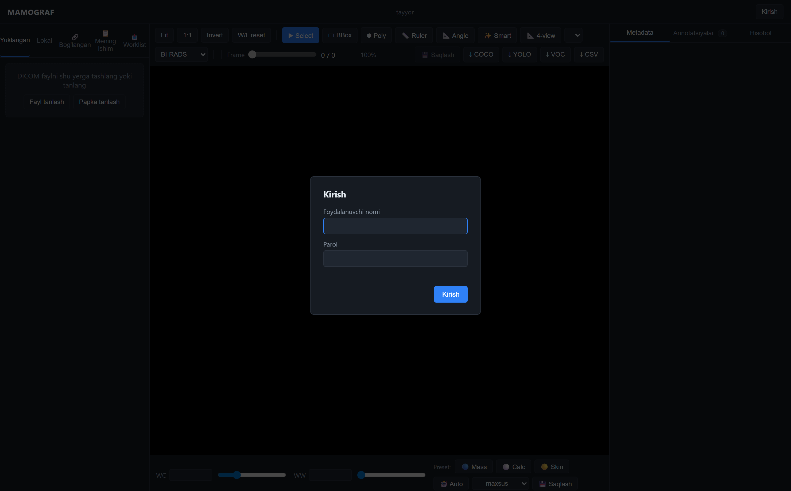

**Rollar:**

| Rol | Imkoniyatlari |
|---|---|
| **admin** | Hamma narsa: foydalanuvchilar, modellar, o'qitish, PACS, sozlamalar |
| **reviewer** | Annotatsiyalarni tekshirish/tasdiqlash, o'qitish, statistika, PACS |
| **annotator** | Tasvir ko'rish va annotatsiya qilish (faqat o'ziniki) |

Kirish JWT token asosida; sessiya muddati tugaganda qayta kirish so'raladi.

---

## 3. Asosiy ekran — DICOM ko'ruvchi

Kirilgandan so'ng asosiy ekran ochiladi: chapda fayllar ro'yxati, markazda DICOM ko'ruvchi, o'ngda metadata paneli, yuqorida asboblar paneli.

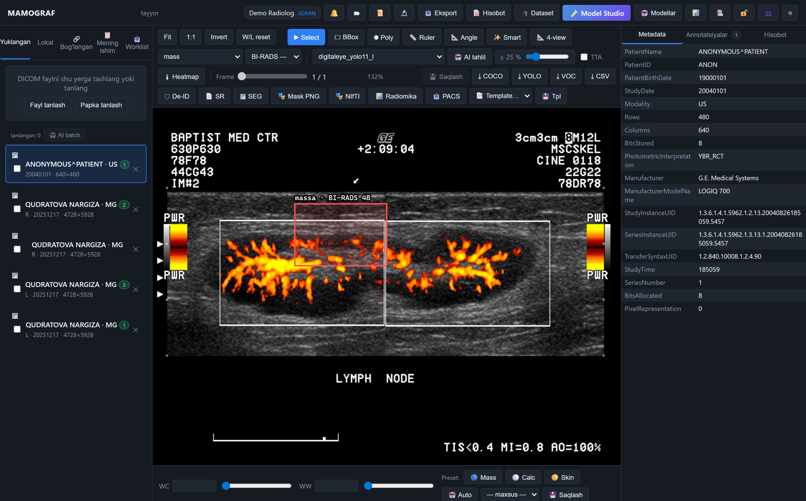

**Asosiy imkoniyatlar:**
- **Yuklash** — DICOM fayllarni yuklash (`Fayl tanlash` / `Papka tanlash`). Yuklashda **avtomatik anonimlashtirish** (PHI o'chiriladi).
- **Lokal disk** — server diskidagi DICOM'larni ko'rish (`LOCAL_DICOM_ROOT`).
- **Window/Level (WL)** — yorqinlik/kontrastni sozlash; tayyor preset'lar.
- **Zoom / pan / 1:1 / Invert** — masshtab, surish, haqiqiy o'lcham, ranglarni teskari qilish.
- **Multi-frame / 4-view** — ko'p kadrli tasvirlar va 4 proeksiyani yonma-yon ko'rish.
- **Heatmap** — AI ishonch issiqlik xaritasi.
- **Metadata paneli** — bemor, study, qurilma, proeksiya (CC/MLO), laterallik ma'lumotlari.

---

## 4. Annotatsiya (lezyon belgilash)

Radiolog tasvirda shubhali sohalarni belgilaydi. Yuqoridagi `ui_viewer` skrinshotida belgilangan **massa** (qizil quti) va pastdagi sinf tugmalari (Mass / Calc / Skin) ko'rinadi.

**Annotatsiya turlari va atributlari:**
- **Quti (bbox)** va **ko'pburchak (polygon)** — lezyon shaklini belgilash.
- **Ko'p yorliq (multi-label)** — bitta o'choqqa bir nechta sinf.
- **BI-RADS kategoriyasi** — har lezyonga (0–6, 4A/4B/4C).
- **Izoh (note)** — erkin matn.
- **Holat (status):** `draft` → `submitted` → `approved` / `rejected` (reviewer tasdig'i).

**Ruxsatlar:** annotator faqat o'zi yaratgan annotatsiyani tahrirlaydi; reviewer/admin hammasini ko'rib chiqadi va tasdiqlaydi.

---

## 5. AI yordami (inference)

Dastur lezyonlarni avtomatik topadigan AI modellariga ega:

- **Avto-inference** — yuklashda avtomatik bbox'lar (ixtiyoriy, `AUTO_INFER_ON_UPLOAD`).
- **Smart-click** — bir marta bosilganda model atrofdagi o'choqni topib quti chizadi.
- **Uncertainty heatmap** — model qayerda "ishonchsiz" ekanini issiqlik xaritasida ko'rsatadi (TTA asosida).
- **Batch inference** — bir nechta tasvirga bir vaqtda model qo'llash.
- **WBF ensemble + TTA** — bir nechta model va aylantirishlar natijasini birlashtirish (aniqlikni oshiradi).

Model arxitekturalari: **BCA-YOLO** (bilateral cross-attention), **TILLNet-Det** (rasm + klinik matn), **XS-Classifier** (hisobot matnini tasniflash).

---

## 6. 📝 Hisobot generatori

Belgilangan lezyonlardan **mammografiya hisoboti qoralamasini** avtomatik yaratadi. Asboblar panelidagi **📝 Hisobot** tugmasi bilan ochiladi.

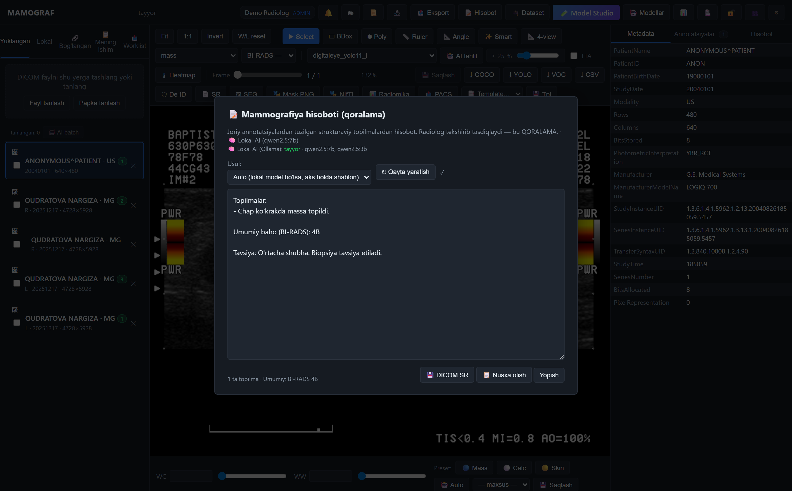

**Qanday ishlaydi:** annotatsiyalar → strukturaviy topilmalar (laterallik, kvadrant, tur, o'lcham, BI-RADS) → hisobot matni.

**Uchta usul:**

| Usul | Tavsif |
|---|---|
| **Boyitilgan shablon** | Modelsiz, deterministik, bir zumda. Butunlay oflayn, eng xavfsiz. |
| **Lokal AI (Ollama)** | Mashinangizdagi `qwen2.5` modeli tabiiy matn yozadi — **internet/API kalit shart emas**. |
| **Auto** | Lokal model bo'lsa undan, aks holda shablonga tushadi. |

> Skrinshotda **🧠 Lokal AI: tayyor · qwen2.5:7b** ko'rinadi — model GPU'da ishlaydi. Birinchi hisobot ~10s (model yuklanadi), keyingilari ~5s.

**Xavfsizlik:** model **faqat berilgan topilmalardan** foydalanadi (to'qib chiqarmaydi), `temperature=0` bilan barqaror. Chiqish doim **QORALAMA** — radiolog tahrirlaydi va tasdiqlaydi.

Chiqish tugmalari:
- **💾 DICOM SR** — hisobotni standart **DICOM Structured Report** sifatida saqlash (bemor/study metadatasi meros olinadi).
- **📋 Nusxa olish** — matnni clipboard'ga.

---

## 7. 🧪 Model Studio — model o'qitish

O'z annotatsiyalaringizdan **yangi YOLO modelini GPU'da o'qitish** uchun to'liq interfeys. Asboblar panelidagi **🧪 Model Studio** tugmasi bilan ochiladi.

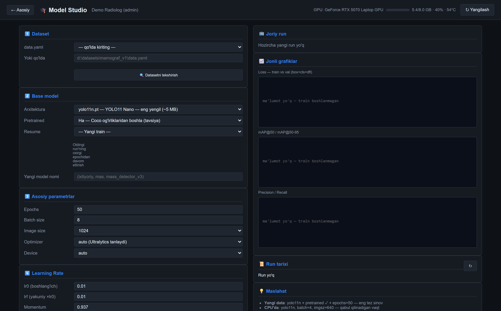

**Imkoniyatlar:**
- **Dataset tanlash** + `data.yaml` **tekshiruvi** (rasm soni, class taqsimoti, rasm↔label mosligi, buzuq fayllar).
- **Base model** (YOLO11 n/s/m/l/x), pretrained, **Resume** (oldingi run'dan davom ettirish).
- To'liq parametrlar: epochs, batch, imgsz, optimizer, learning rate, augmentation.
- **GPU monitor** (yuqorida): VRAM band/jami, utilization, harorat — real vaqtda (skrinshotda **RTX 5070 · 5.4/8.0 GB · 40% · 54°C**).
- **Oldindan VRAM ogohlantirishi** — imgsz/batch sig'maslik xavfini oldindan biladi.
- **▶ Train / ⏹ Stop** — o'qitishni boshlash/to'xtatish (to'xtatilganda `last.pt` saqlanadi, keyin Resume bilan davom ettiriladi).
- **Jonli grafiklar** — train/val loss, mAP@50, mAP@50-95, precision/recall real vaqtda chiziladi.
- **Run tarixi** — o'tgan run'lar, metrikalar.
- **Avto-deploy** — o'qitilgan model `app/models/` ga ko'chiriladi va darhol ishlatishga tayyor.

---

## 8. 🎓 Dataset tayyorlash

Annotatsiyalardan **Ultralytics YOLO formatidagi datasetni** avtomatik yaratadi. Asboblar panelidagi **🎓 Dataset** tugmasi bilan ochiladi.

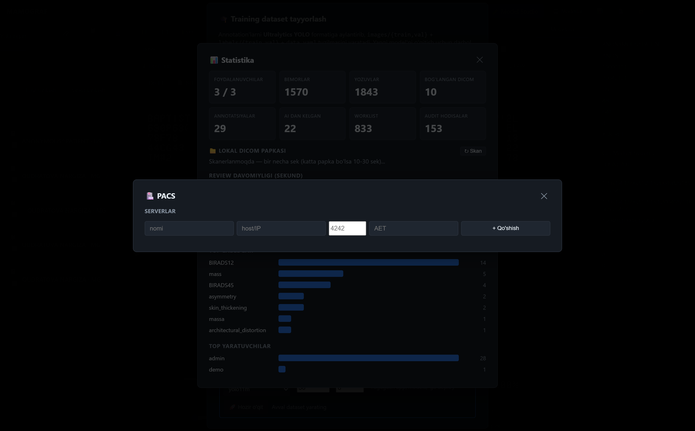

- Annotatsiyalar → `images/{train,val}` + `labels/{train,val}` + `data.yaml`.
- **Bemor darajasida train/val bo'linishi** (data leakage'ning oldini oladi).
- Tasvir o'lchami va boshqa parametrlarni sozlash.
- Natija to'g'ridan-to'g'ri Model Studio'da ishlatishga tayyor.

---

## 9. 🤖 Modellar dashboard

Mavjud AI modellarini boshqarish. Asboblar panelidagi **🤖 Modellar** tugmasi bilan ochiladi.

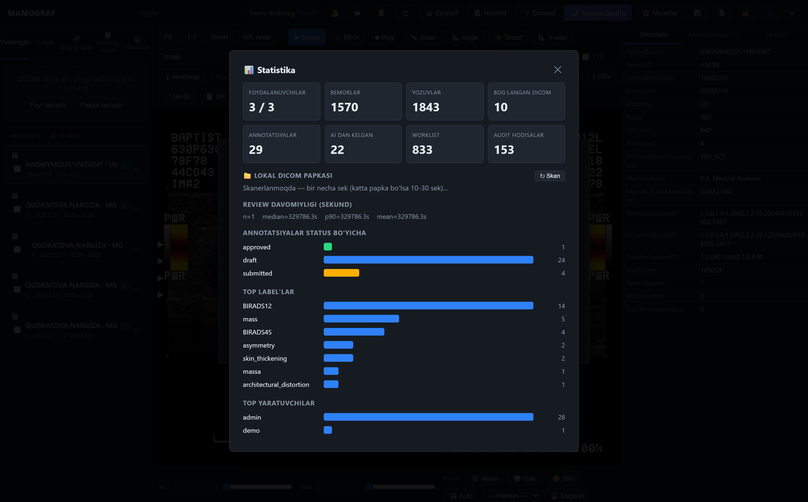

- Har model: hajm, qachon qo'shilgan, nechta annotation chiqargan.
- `trained_*` prefiksli modellar — lokal o'qitilgan, o'chirish mumkin.
- **Active learning** — AI'dan farqli/tasdiqlangan annotatsiyalar sonini sanab, "qayta o'qitish vaqti keldi" deб tavsiya beradi.

---

## 10. Eksport formatlari

Asboblar panelidagi **📤 Eksport** orqali turli formatlar:

| Format | Tavsif |
|---|---|
| **Annotated DICOM** | Annotatsiyalar bilan DICOM |
| **DICOM-SEG** | Segmentatsiya obyektlari (standart) |
| **DICOM-SR** | Strukturaviy hisobot (annotatsiyalar yoki to'liq hisobot) |
| **Mask (PNG)** | Bineriy/rangli maska |
| **COCO JSON** | Detection dataset formati |
| **CSV** | Annotatsiya tarixi / radiomics jadvallari |

---

## 11. 📊 Statistika

Dataset va annotatsiyalar bo'yicha umumiy ko'rsatkichlar. Asboblar panelidagi **📊** tugmasi bilan ochiladi.

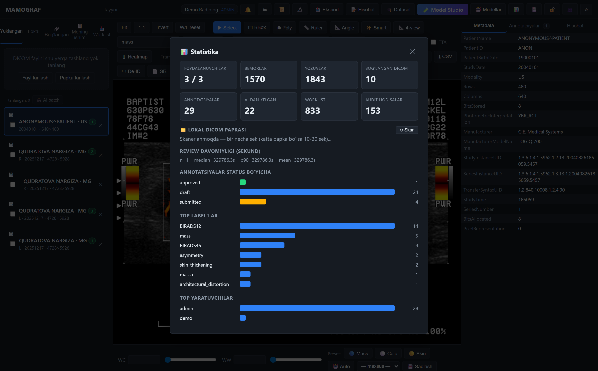

- Jami DICOM, annotatsiyalar, bemorlar soni.
- Class (sinf) taqsimoti, BI-RADS taqsimoti.
- Lokal DICOM ombori statistikasi.

---

## 12. 🏥 PACS integratsiyasi

Kasalxona **PACS serverlari** bilan ishlash. Asboblar panelidagi **🏥** tugmasi bilan ochiladi.

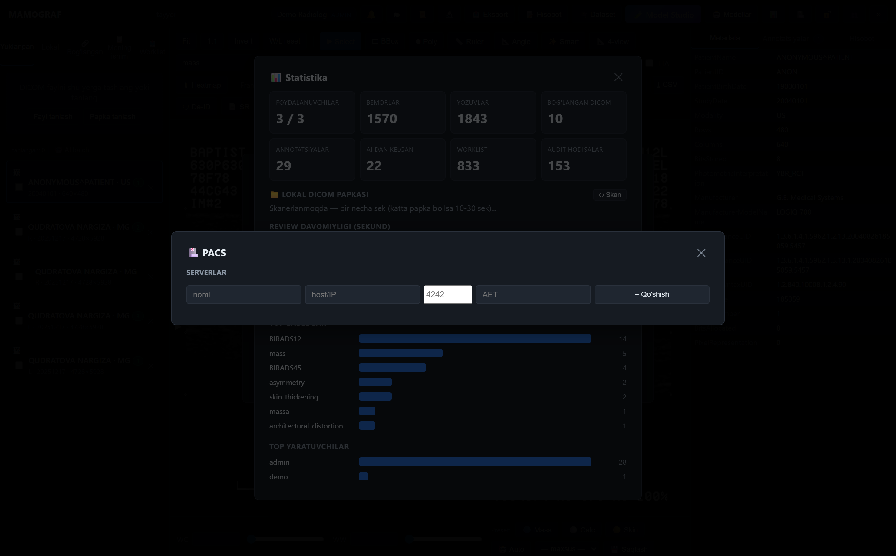

- PACS serverlarni qo'shish/boshqarish (AE Title, host, port).
- **C-ECHO** — ulanishni tekshirish.
- **C-FIND** — bemor/study qidirish.
- **C-STORE** — DICOM (yoki SR) ni PACS'ga jo'natish.
- **C-MOVE/GET** — PACS'dan tasvir olib kelish.
- **Worklist** — ish ro'yxatiga qo'shish.

---

## 13. 📜 Audit va tarix

Barcha o'zgarishlar kuzatiladi. Asboblar panelidagi **📜** tugmasi bilan ochiladi.

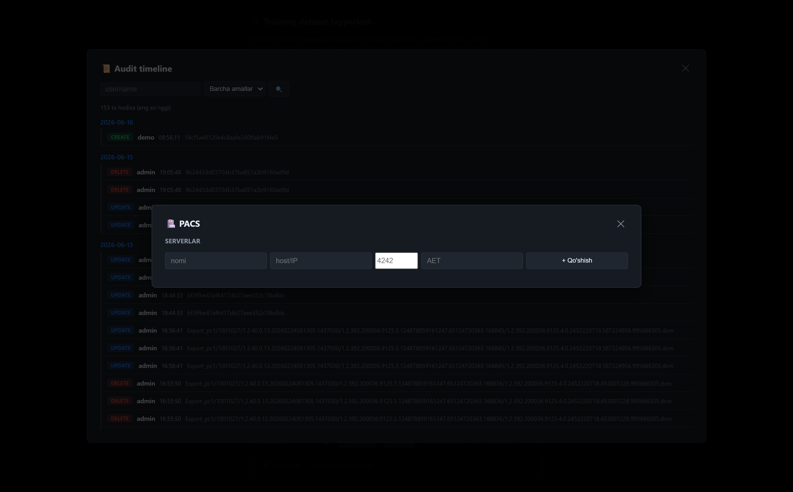

- **Audit timeline** — kim, qachon, nimani o'zgartirdi.
- **Annotatsiya tarixi** — har annotatsiyaning versiyalari (create/edit/approve/reject).
- **Bildirishnomalar (🔔)** — tasdiqlash/rad etish xabarlari.

---

## 14. 👥 Foydalanuvchilar boshqaruvi

Faqat **admin** uchun. Asboblar panelidagi **👥** tugmasi bilan ochiladi.

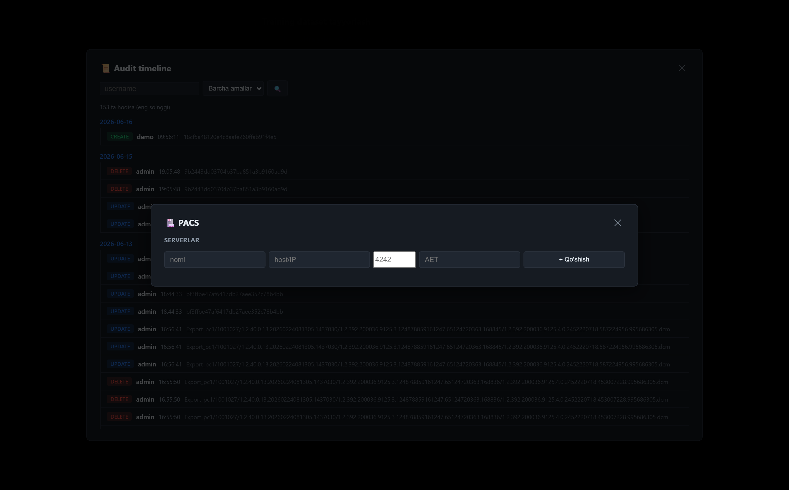

- Foydalanuvchi qo'shish/tahrirlash/o'chirish.
- Rol berish (admin/reviewer/annotator).
- Parolni qayta o'rnatish, faollashtirish/o'chirish.
- **2FA (TOTP)** — har foydalanuvchi uchun ikki bosqichli autentifikatsiya.

---

## 15. Xavfsizlik va maxfiylik

- **Avtomatik anonimlashtirish** — yuklashda PHI tag'lari (ism, ID, sana, shifokor, muassasa) o'chiriladi/almashtiriladi. Annotatsiya, AI va eksport **PHI-siz nusxa** ustida ishlaydi. (`AUTO_DEIDENTIFY=0` bilan o'chirish mumkin.)
- **JWT autentifikatsiya** + rol asosidagi ruxsatlar.
- **TOTP 2FA** — ixtiyoriy ikki bosqichli kirish.
- **Lokal AI** — hisobotlar tashqi xizmatga jo'natilmaydi (Ollama mashinangizda).
- Trained model og'irliklari va bemor ma'lumotlari git'ga kiritilmaydi.

---

## 16. Texnik arxitektura

Tizimning umumiy arxitekturasi:

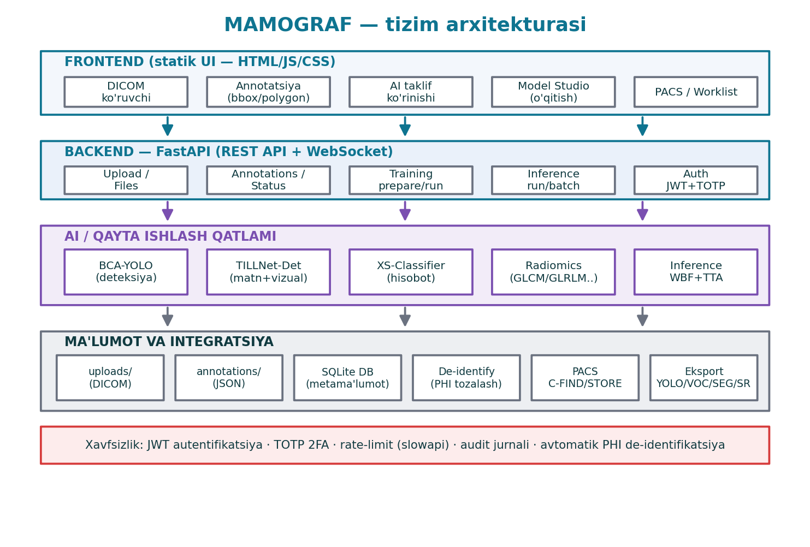

**Model arxitekturalari:**

| Model | Vazifa |
|---|---|
| 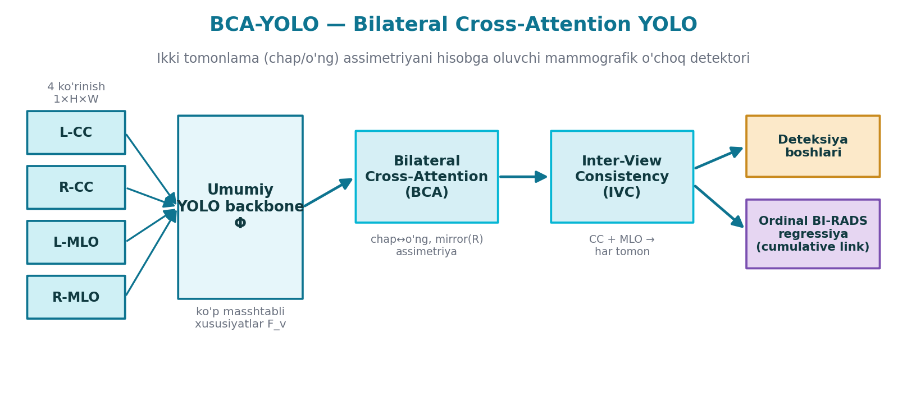 | **BCA-YOLO** — ikki ko'krakni qiyoslab o'choq topish |
| 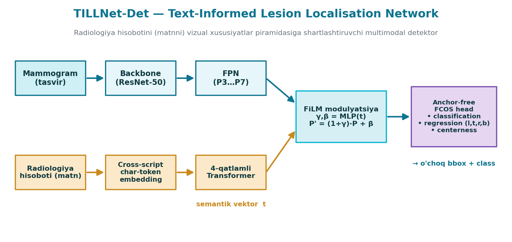 | **TILLNet-Det** — rasm + klinik matn (multimodal) detektor |

**Active learning sikli** (AI ↔ radiolog):

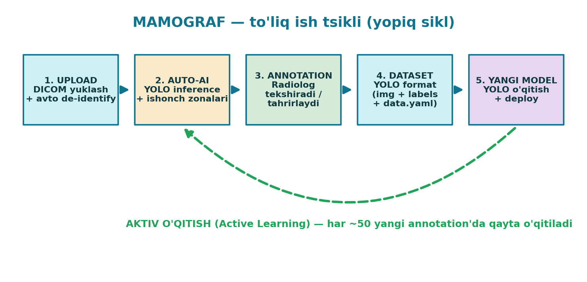

---

## 17. Tipik ish oqimi

```
1. DICOM yuklash (avtomatik anonimlashtirish)
        ↓
2. AI yordami (avto-bbox / smart-click) yoki qo'lda annotatsiya + BI-RADS
        ↓
3. Reviewer tasdiqlaydi (status: approved)
        ↓
4. 📝 Hisobot yaratish (lokal AI/shablon) → tahrirlash → 💾 DICOM SR
        ↓
5. (Ixtiyoriy) 🎓 Dataset → 🧪 Model Studio → yangi modelni o'qitish (GPU)
        ↓
6. Yangi model bilan aniqlik oshadi → sikl takrorlanadi
```

---

> **Eslatma:** Bu qo'llanma `MAMOGRAF` web-ilovasining joriy versiyasi uchun. Skrinshotlar `demo` hisobi va namuna DICOM bilan olingan. Skrinshotlar `doc_assets/` papkasida saqlanadi va `python scripts/make_full_screenshots.py` bilan qayta yaratilishi mumkin (server 8002 da ishlab turishi kerak).
