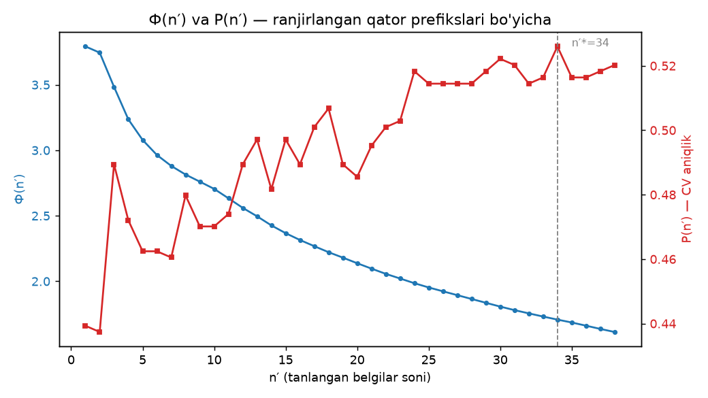

# boolfs — bulcha belgi tanlash va minimal masofa klassifikatori hisobot

Metod: Xamdamov (2017), III bob — (3.2.2) kriteriy, (3.4.5) ranjirlangan qator, (3.6.2)–(3.6.4) minimal masofa klassifikatori.

- Train ROI: **519** ta; sinf taqsimoti: BIRADS12=16, BIRADS45=9, architectural_distortion=2, asymmetry=12, calcification=123, lymph_node=229, mass=125, other=3
- Tanlangan belgilar: **n′\* = 34** / 38, P(n′\*) = **0.5260** (aralash CV: 5-fold + LOO)

## 1. Ranjirlangan qator — top-20 belgi ((3.4.5))

| n′ | Belgi | r_j = a_j/(b_j+c_j) | Ф(n′) |
|---|---|---|---|
| 1 | `glcm_d1_correlation` | 3.7927 | 3.7927 |
| 2 | `glcm_d3_correlation` | 3.6980 | 3.7448 |
| 3 | `grad_sobel_std` | 3.0477 | 3.4838 |
| 4 | `glcm_d1_dissimilarity` | 2.6482 | 3.2359 |
| 5 | `glcm_d3_dissimilarity` | 2.5629 | 3.0787 |
| 6 | `glcm_d1_contrast` | 2.4851 | 2.9639 |
| 7 | `grad_sobel_mean` | 2.4541 | 2.8805 |
| 8 | `int_skew` | 2.4169 | 2.8147 |
| 9 | `glcm_d3_contrast` | 2.3823 | 2.7603 |
| 10 | `int_kurtosis` | 2.2823 | 2.7053 |
| 11 | `shape_compactness` | 2.0605 | 2.6335 |
| 12 | `int_std` | 1.9347 | 2.5603 |
| 13 | `shape_area_ratio` | 1.8928 | 2.4960 |
| 14 | `lbp_u2` | 1.7488 | 2.4266 |
| 15 | `glcm_d1_homogeneity` | 1.7324 | 2.3671 |
| 16 | `lbp_u1` | 1.7120 | 2.3150 |
| 17 | `int_entropy` | 1.6845 | 2.2680 |
| 18 | `glcm_d3_homogeneity` | 1.6221 | 2.2220 |
| 19 | `lbp_u3` | 1.6035 | 2.1805 |
| 20 | `lbp_u6` | 1.5242 | 2.1377 |

## 2. Ф(n′) va P(n′) grafigi

## 3. Sinf juftliklari ajraluvchanlik matritsasi (pairwise Ф, λ\*)

Katta qiymat — sinflar tanlangan belgi fazosida yaxshi ajraladi; kichigi — ajralmaydi (maqola uchun asosiy jadval).

| | BIRADS12 | BIRADS45 | architectural_ | asymmetry | calcification | lymph_node | mass | other |
|---|---|---|---|---|---|---|---|---|
| **BIRADS12** | 0.000 | 0.421 | 0.165 | 0.766 | 0.118 | 0.080 | 0.165 | 0.221 |
| **BIRADS45** | 0.421 | 0.000 | 0.440 | 0.843 | 0.069 | 0.044 | 0.066 | 0.543 |
| **architectural_** | 0.165 | 0.440 | 0.000 | 0.191 | 0.018 | 0.013 | 0.019 | 0.532 |
| **asymmetry** | 0.766 | 0.843 | 0.191 | 0.000 | 0.115 | 0.074 | 0.121 | 0.317 |
| **calcification** | 0.118 | 0.069 | 0.018 | 0.115 | 0.000 | 0.819 | 0.772 | 0.025 |
| **lymph_node** | 0.080 | 0.044 | 0.013 | 0.074 | 0.819 | 0.000 | 0.476 | 0.019 |
| **mass** | 0.165 | 0.066 | 0.019 | 0.121 | 0.772 | 0.476 | 0.000 | 0.028 |
| **other** | 0.221 | 0.543 | 0.532 | 0.317 | 0.025 | 0.019 | 0.028 | 0.000 |

Eng yomon ajraladigan juftliklar: architectural_distortion–lymph_node (Ф=0.013); architectural_distortion–calcification (Ф=0.018); lymph_node–other (Ф=0.019)

## 4b. YOLO vs YOLO+boolfs ensemble (confusion taqqoslash)

Moslashtirish: IoU≥0.3, conf≥0.05; mos kelgan detektsiyalar: 95 (pred=329, GT=163); vazn: `yolo11s_8class.pt`

| α (YOLO ulushi) | P |
|---|---|
| 0.0 — faqat boolfs | 0.5474 |
| 0.1 | 0.7053 |
| 0.3 | 0.7895 |
| 0.5 | 0.8421 |
| 0.7 | 0.8526 ★ |
| 1.0 — faqat YOLO | 0.7368 |

**YOLO (faqat) confusion:**

| | BIRADS12 | BIRADS45 | architectural_ | asymmetry | calcification | lymph_node | mass | other |
|---|---|---|---|---|---|---|---|---|
| **BIRADS12** | 0 | 1 | 0 | 0 | 0 | 2 | 0 | 0 |
| **BIRADS45** | 1 | 0 | 0 | 0 | 0 | 1 | 1 | 0 |
| **architectural_** | 0 | 0 | 0 | 0 | 0 | 0 | 0 | 0 |
| **asymmetry** | 1 | 0 | 0 | 1 | 0 | 0 | 1 | 0 |
| **calcification** | 13 | 0 | 0 | 0 | 12 | 0 | 0 | 0 |
| **lymph_node** | 2 | 0 | 0 | 0 | 0 | 44 | 0 | 0 |
| **mass** | 0 | 0 | 0 | 0 | 0 | 2 | 13 | 0 |
| **other** | 0 | 0 | 0 | 0 | 0 | 0 | 0 | 0 |

**Ensemble (α=0.7) confusion:**

| | BIRADS12 | BIRADS45 | architectural_ | asymmetry | calcification | lymph_node | mass | other |
|---|---|---|---|---|---|---|---|---|
| **BIRADS12** | 0 | 0 | 0 | 0 | 0 | 3 | 0 | 0 |
| **BIRADS45** | 0 | 0 | 0 | 0 | 1 | 1 | 1 | 0 |
| **architectural_** | 0 | 0 | 0 | 0 | 0 | 0 | 0 | 0 |
| **asymmetry** | 0 | 0 | 0 | 1 | 1 | 0 | 1 | 0 |
| **calcification** | 1 | 0 | 0 | 0 | 23 | 0 | 1 | 0 |
| **lymph_node** | 2 | 0 | 0 | 0 | 0 | 44 | 0 | 0 |
| **mass** | 0 | 0 | 0 | 0 | 0 | 2 | 13 | 0 |
| **other** | 0 | 0 | 0 | 0 | 0 | 0 | 0 | 0 |

## 5. Xulosa

- Umumiy P: YOLO 0.7368 → ensemble 0.8526 (+11.6 punkt).
- Yaxshilangan sinflar: **calcification** (recall 0.48→0.92).
- Kam sonli sinflar (architectural_distortion, other): baholash leave-one-out rejimida; misollar juda oz bo'lgani uchun xulosa statistik jihatdan ehtiyotkorlik bilan talqin qilinishi kerak — etalon vektor 1–2 misolga tayanadi.